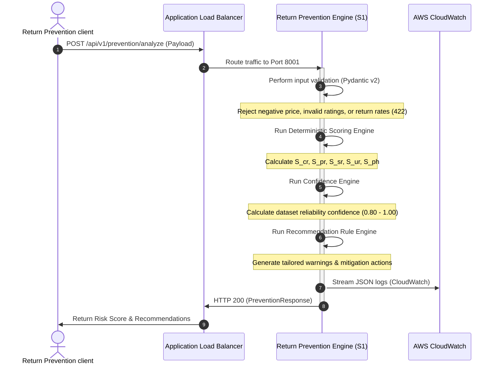

# Service #1 — Return Prevention Engine: Architecture Document

## Overview
The **Return Prevention Engine** (S1) is a microservice operating within the **VPC-1 Intelligence Layer** of the Amazon Circular Intelligence OS. Its main objective is to calculate return risks and generate customized recommendations for customers *prior* to a purchase decision, preventing avoidable returns at the source.

---

## VPC Architecture & Domain Design

The Circular Intelligence OS utilizes a 4-domain design to segregate services by concern. S1 resides in the **Intelligence Layer** (VPC-1) because it performs advanced predictive analysis on customer behavior, product metrics, and seller historical ratings.

```
+-------------------------------------------------------------+
|               VPC-1 Intelligence Layer                      |
|                                                             |
|   +---------------------------------------------------+     |
|   |         ECS Fargate (Return Prevention S1)        |     |
|   |                  [Port: 8001]                     |     |
|   +--------------------------+------------------------+     |
|                              |                              |
+------------------------------|------------------------------+
                               |
                               | (HTTP / JSON via ALB)
                               v
+-------------------------------------------------------------+
|               VPC-4 Central Knowledge Platform               |
|                                                             |
|   +---------------------------------------------------+     |
|   |      EventBridge + CloudWatch + Neptune Graph     |     |
|   +---------------------------------------------------+     |
+-------------------------------------------------------------+
```

---

## Technical Architecture & Request Flow

The service is built on a containerized FastAPI framework. It is stateless, making it fully horizontal-scalable and ideal for deployment on AWS ECS Fargate behind an Application Load Balancer (ALB).



---

## Core Components

1. **API Router (`app/api/routes.py`)**: Exposes versioned endpoints `/api/v1/prevention/analyze` and the health endpoint `/health`.
2. **Pydantic Validation Layer (`app/models/schemas.py`)**: Uses Pydantic v2 to strictly validate input constraints at the controller level.
3. **Deterministic Scoring Engine (`app/services/scoring.py`)**: An isolated service module that computes individual risk scores and aggregates them using weighted algorithms.
4. **Recommendation Engine (`app/services/recommendations.py`)**: Analyzes risk drivers and customer purchase context to generate targeted mitigation warnings and explanations.
