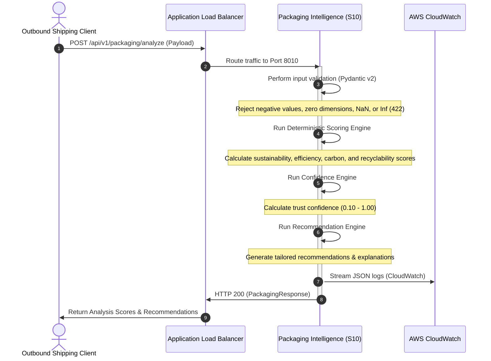

# Service #10 — Packaging Intelligence: Architecture Document

## Overview
The **Packaging Intelligence Service** (S10) is a microservice operating within the **VPC-1 Intelligence Layer** of the Amazon Circular Intelligence OS. Its primary objective is to calculate packaging sustainability scores, packaging volumetric/gravimetric efficiency, carbon footprint estimates, recyclability, and generate optimization recommendations prior to outbound shipping.

---

## VPC Architecture & Domain Design

S10 resides in the **Intelligence Layer** (VPC-1) alongside S1 (Return Prevention) and S3 (Fraud & Trust). This group of services performs critical analysis on product attributes, physical properties, and customer transactions to discover optimization opportunities before packages leave fulfillment centers.

```
+-------------------------------------------------------------+
|               VPC-1 Intelligence Layer                      |
|                                                             |
|   +---------------------------------------------------+     |
|   |         ECS Fargate (Packaging S10)               |     |
|   |                  [Port: 8010]                     |     |
|   +--------------------------+------------------------+     |
|                              |                              |
+------------------------------|------------------------------+
                               |
                               | (HTTP / JSON via ALB)
                               v
+-------------------------------------------------------------+
|               VPC-4 Central Knowledge Platform               |
|                                                             |
|   +---------------------------------------------------+     |
|   |      EventBridge + CloudWatch + Neptune Graph     |     |
|   +---------------------------------------------------+     |
|                                                             |
+-------------------------------------------------------------+
```

---

## Technical Architecture & Request Flow

The service is built on a containerized FastAPI framework. It is stateless, making it fully horizontally scalable and ideal for deployment on AWS ECS Fargate behind an Application Load Balancer (ALB).



---

## Core Components

1. **API Router (`app/api/routes.py`)**: Exposes versioned endpoint `/api/v1/packaging/analyze` and the health endpoint `/health`.
2. **Pydantic Validation Layer (`app/models/schemas.py`)**: Uses Pydantic v2 to strictly validate input constraints at the controller level (preventing NaN, Infinity, negative values, and empty strings).
3. **Deterministic Scoring Engine (`app/services/scoring.py`)**: Computes individual component scores (sustainability, volumetric efficiency, empty space ratio, carbon footprint, recyclability) and aggregates them using weighted algorithms.
4. **Recommendation Engine (`app/services/recommendations.py`)**: Evaluates score drivers to produce clear, actionable package optimization suggestions and warning explanations.

---

## 🔗 Integration Readiness & Ecosystem Connection

The Packaging Intelligence Service (S10) is designed to operate in close coordination with other Circular Intelligence OS microservices and client interfaces:

1. **Service #1 — Return Prevention Engine**:
   - *Interface*: S10's dimensional analysis outputs can be sent to S1. If a product's return reason is frequently flagged as "damaged in transit" or "size incorrect," S1 queries S10 to analyze if the packaging weight or box thickness is insufficient.
2. **Service #2 — Truth Discovery Engine**:
   - *Interface*: S2 discovers seller and customer truth profiles. It ingests packaging discrepancies from S10 (e.g. if the seller reported a 10g box but S10 detects 200g of plastic) to flag potential product listing fraud.
3. **Service #3 — Fraud & Trust Engine**:
   - *Interface*: S3 ingests packaging efficiency scores to identify systematic "empty box" return abuse patterns or seller packaging quality downgrades.
4. **Service #12 — Learning & Knowledge Graph**:
   - *Interface*: S10 events can be streamed to EventBridge and ingested by S12 to map relations between `Product` -> `PackagingMaterial` -> `CarbonImpact` and explore systemic footprint optimization paths.
5. **Frontend Sustainability Dashboard**:
   - *Interface*: Consumes the `/api/v1/packaging/analyze` endpoint directly to render real-world graphics representing material circularity, empty space ratios, and carbon reduction milestones for warehouse managers.

