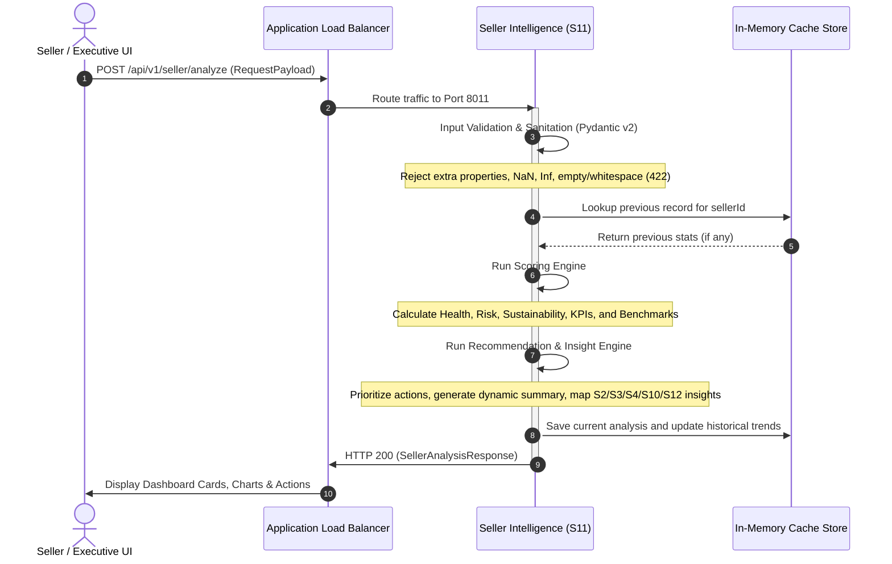

# Service #11 — Seller Intelligence Engine: Architecture Document

## Overview
The **Seller Intelligence Engine** (S11) is a microservice operating within **VPC-3 Product & Business Layer** of the Amazon Circular Intelligence OS. Its primary purpose is to aggregate and process performance signals (returns, ratings, fraud incidents, packaging efficiency, sustainability inputs) and convert them into actionable seller intelligence, executive KPIs, and formatted dashboard reports.

---

## Position in Ecosystem & Domain Design

S11 functions as the business-facing intelligence layer. It connects the deep analytics layers (VPC-1 and VPC-2) and knowledge systems (VPC-4) directly to seller, executive, and operations user interfaces.

```
VPC-1 Intelligence Layer (S2, S3, S10)
              │
              ├─────────────────────────┐ (Ingests Insights)
              ▼                         ▼
VPC-3 Product & Business Layer   VPC-4 Central Knowledge Platform (S12)
   ┌───────────────────────┐            │
   │ ECS Fargate (S11)     │◄───────────┘
   │   [Port: 8011]        │
   └──────────┬────────────┘
              │ (Serves Dashboards)
              ▼
   ┌───────────────────────┐
   │   Seller Dashboard    │
   │  Executive Dashboard  │
   │ Operations Dashboard  │
   └───────────────────────┘
```

---

## Technical Architecture & Request Flow

The Seller Intelligence Engine is built on containerized Python 3.11 and FastAPI. The service contains:
1. **API Router (`app/api/routes.py`)**: Exposes public endpoints, validates parameters, and handles JSON responses.
2. **Pydantic Validation Layer (`app/models/schemas.py`)**: Performs strict model validation (rejects `NaN`, `Infinity`, empty strings, and unexpected attributes using `ConfigDict(extra="forbid")`).
3. **Scoring Engine (`app/services/scoring.py`)**: Computes analytical scores (Seller Health, Return Risk, Fraud Risk, Sustainability Score), benchmarks, and executive KPIs.
4. **Recommendation Engine (`app/services/recommendations.py`)**: Evaluates thresholds to generate dynamic summaries, priority actions, and maps service-specific insights.



---

## Future Persistence Design

### Current State: Thread-Safe In-Memory Store
To achieve high performance and ease of deployment for immediate validation, S11 utilizes a thread-safe, in-memory Python dictionary cache protected by a threading lock. It maintains historical trend points (up to 10 latest entries per seller) for health, returns, and fraud rates.

### Future State: Amazon DynamoDB Persistence
For production deployment, S11 will migrate to a serverless **Amazon DynamoDB** database.
- **Partition Key**: `sellerId` (String)
- **Sort Key**: `analysisTimestamp` (String, ISO-8601)
- **Data Model**:
  - Store full historical records of each analysis run.
  - Enable multi-tenant dashboard rendering.
  - Support high-speed time-series queries for dashboard trend charting.
- **Benefits**:
  - Horizontal scalability with zero server management.
  - Sub-10ms latency for dashboard retrievals.
  - Automatic TTL (Time-To-Live) support for archiving older analysis reports.
