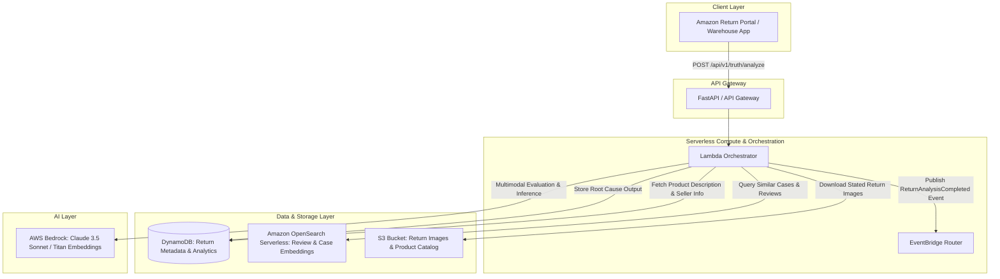
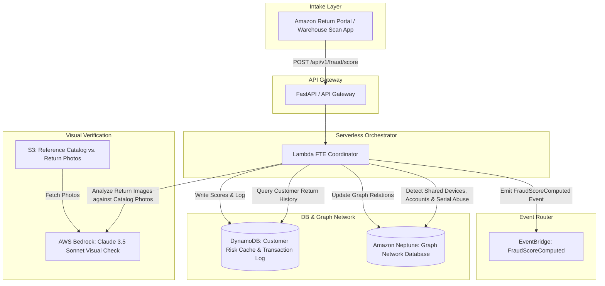

# Amazon Circular Intelligence OS: AI Intelligence Layer
## Architecture & Implementation Blueprint

This document specifies the technical design, request flows, AWS components, APIs, database schemas, and folder structures for the **Truth Discovery Engine (TDE)** and the **Fraud & Trust Engine (FTE)**.

---

# SERVICE 1: TRUTH DISCOVERY ENGINE (TDE)

The Truth Discovery Engine determines the **true root cause** behind every product return, resolving inaccuracies in customer-stated reasons (e.g., classifying a stated "defective" reason as a true "expectation mismatch" or "wrong size").

## 1. Architecture Diagram


## 2. Request Flow
1. **Return Initiation**: Customer selects a return reason (e.g., "Defective") and uploads a comment + optional image.
2. **Event Trigger / API Call**: The return portal triggers the FastAPI `/api/v1/truth/analyze` endpoint.
3. **Data Enrichment**: The Lambda orchestrator fetches:
   - Product Description & Metadata from DynamoDB.
   - Recent customer reviews & historical return cases from OpenSearch.
4. **Vector Search (OpenSearch)**: Semantic search finds the top 3 similar return cases and identifies if recent product reviews frequently mention issues like "runs small" or "misleading color".
5. **Multimodal LLM Reasoning (Bedrock)**:
   - Claude 3.5 Sonnet is invoked with a structured system prompt, receiving the product details, reviews, customer comments, and the return image.
   - The LLM determines the *actual root cause* and provides supporting evidence.
6. **Persistence & Egress**:
   - The analysis result is saved to DynamoDB.
   - A `ReturnAnalysisCompleted` event is published to AWS EventBridge.

## 3. AWS Components
* **AWS Bedrock**: Hosts `anthropic.claude-3-5-sonnet-v1` for reasoning and `amazon.titan-embed-text-v2` for generating search embeddings of comments and reviews.
* **Amazon OpenSearch Serverless (Vector Engine)**: Performs k-NN semantic search on product reviews and historical return cases to find correlated feedback (e.g., "fits too tight").
* **AWS DynamoDB**: Single-table design for low-latency retrieval of product metadata, seller metrics, and return analysis results.
* **AWS EventBridge**: Decoupled event bus to route return analysis outputs to downstream inventory, seller dashboards, and refund processors.
* **AWS Lambda**: Serverless Python execution environment hosting the TDE logic.

## 4. API Design (OpenAPI 3.0 Spec)
* **Route**: `POST /api/v1/truth/analyze`
* **Request Schema**:
```json
{
  "returnId": "RET-990812",
  "customerId": "CUST-10928",
  "productId": "PROD-B07XJ8C",
  "statedReason": "Defective",
  "customerComment": "The camera screen doesn't work. It just shows black lines.",
  "images": [
    "s3://amazon-circular-intel-returns/returns/RET-990812/item_front.jpg"
  ]
}
```
* **Response Schema**:
```json
{
  "returnId": "RET-990812",
  "actualRootCause": "Expectation Mismatch",
  "confidence": 0.92,
  "evidence": [
    "Customer comment indicates hardware defect, but OpenSearch check on reviews reveals compatibility issues with Android 14.",
    "Similar cases (89%) for this item show firmware incompatibility, not physical defects.",
    "Return photo shows screen backlight is active, suggesting it is a software boot loop rather than a cracked/defective screen."
  ]
}
```

## 5. Event Contracts
### Input Event: `ReturnInitiated`
```json
{
  "Source": "aws.circular.returns",
  "DetailType": "ReturnInitiated",
  "Detail": {
    "returnId": "RET-990812",
    "customerId": "CUST-10928",
    "productId": "PROD-B07XJ8C",
    "statedReason": "Defective",
    "customerComment": "The camera screen doesn't work. It just shows black lines.",
    "images": ["s3://amazon-circular-intel-returns/returns/RET-990812/item_front.jpg"],
    "timestamp": "2026-06-13T00:46:44Z"
  }
}
```
### Output Event: `ReturnAnalysisCompleted`
```json
{
  "Source": "aws.circular.intelligence.tde",
  "DetailType": "ReturnAnalysisCompleted",
  "Detail": {
    "returnId": "RET-990812",
    "productId": "PROD-B07XJ8C",
    "actualRootCause": "Expectation Mismatch",
    "confidence": 0.92,
    "evidence": [
      "Customer comment indicates hardware defect, but OpenSearch check on reviews reveals compatibility issues with Android 14."
    ],
    "recommendations": {
      "routingAction": "LIQUIDATION_ELIGIBLE",
      "sellerAction": "UPDATE_LISTING_COMPATIBILITY_WARNING"
    },
    "timestamp": "2026-06-13T00:47:10Z"
  }
}
```

## 6. Database Schema (DynamoDB)
We use a Single-Table Design.
* **Table Name**: `CircularIntelOSStore`
* **Primary Key (PK)**: `RETURN#<ReturnId>`
* **Sort Key (SK)**: `METADATA` (for details) or `ANALYSIS#TRUTH` (for TDE output)

| PK | SK | Attributes |
|---|---|---|
| `RETURN#RET-990812` | `METADATA` | `CustomerId` (S), `ProductId` (S), `StatedReason` (S), `Timestamp` (S) |
| `RETURN#RET-990812` | `ANALYSIS#TRUTH` | `ActualRootCause` (S), `Confidence` (N), `Evidence` (L), `ProcessedAt` (S) |
| `PRODUCT#PROD-B07XJ8C` | `METADATA` | `Title` (S), `Category` (S), `Description` (S), `SellerId` (S) |

---

# SERVICE 2: FRAUD & TRUST ENGINE (FTE)

The Fraud & Trust Engine scores the risks associated with returns to detect illicit behaviors such as **wardrobing**, **product swapping**, **empty-box fraud**, and **serial return abuse**.

## 1. Architecture Diagram


## 2. Request Flow
1. **Intake Event**: A return package is checked in at an Amazon warehouse, and images are captured of the package/item.
2. **Trigger API**: The inspection scanner calls the `/api/v1/fraud/score` endpoint.
3. **Graph Analysis (Neptune)**:
   - FTE queries the Neptune Graph for connection patterns (e.g., "Is this customer sharing a credit card, IP, or device with an account that has a history of high return-rates or empty-box fraud?").
   - Identifies if this specific product serial number is currently circulating in multiple suspicious return chains.
4. **Visual Discrepancy Detection (Bedrock Vision)**:
   - Claude 3.5 Sonnet compares the physical return photos to pristine product catalog images.
   - Detects indicators of:
     - *Wardrobing*: Tags missing or re-attached loosely, creasing, signs of wear.
     - *Product Swapping*: Color, logo placement, or serial number mismatch.
     - *Empty-box*: Only packing materials present.
5. **Score Aggregation**:
   - FTE combines the Neptune network risk (0.0 to 1.0) and the visual discrepancy risk (0.0 to 1.0) to calculate a final **Fraud Score**, **Trust Score**, and **Authenticity Score**.
6. **Downstream Alerting**:
   - The scores are written to DynamoDB.
   - A `FraudScoreComputed` event is published to EventBridge to instantly hold refunds or flag accounts for manual audit.

## 3. AWS Components
* **AWS Neptune**: Fully-managed graph database storing connections between customers, payment options, device IDs, and returns to surface organized fraud rings.
* **AWS Bedrock**: Runs visual model inspection using Claude 3.5 Sonnet to verify product authenticity, tag integrity, and package contents.
* **AWS DynamoDB**: Stores customer profiles, current risk levels, and historical scores.
* **AWS EventBridge**: Routes high-risk scoring decisions to warehouse operations and customer billing systems.
* **AWS Lambda**: Runs the scoring orchestrator.

## 4. API Design (OpenAPI 3.0 Spec)
* **Route**: `POST /api/v1/fraud/score`
* **Request Schema**:
```json
{
  "customerId": "CUST-10928",
  "productId": "PROD-B07XJ8C",
  "returnId": "RET-990812",
  "paymentMethodHash": "pm_8a39df1c0",
  "deviceId": "dev_mac_990f11",
  "returnHistory": [
    {
      "returnId": "RET-980123",
      "status": "COMPLETED",
      "daysToReturn": 3
    }
  ],
  "images": [
    "s3://amazon-circular-intel-returns/returns/RET-990812/item_label.jpg",
    "s3://amazon-circular-intel-returns/returns/RET-990812/item_contents.jpg"
  ]
}
```
* **Response Schema**:
```json
{
  "returnId": "RET-990812",
  "fraudScore": 0.84,
  "trustScore": 0.18,
  "riskLevel": "HIGH",
  "recommendedAction": "Manual Review",
  "riskFactors": [
    "Wardrobing: Missing retail tags on return garments.",
    "Serial Abuse: Customer has returned 82% of orders in the last 30 days.",
    "Graph Alert: Shared Device ID is linked to 3 accounts blocked for return abuse."
  ]
}
```

## 5. Event Contracts
### Output Event: `FraudScoreComputed`
```json
{
  "Source": "aws.circular.intelligence.fte",
  "DetailType": "FraudScoreComputed",
  "Detail": {
    "returnId": "RET-990812",
    "customerId": "CUST-10928",
    "productId": "PROD-B07XJ8C",
    "fraudScore": 0.84,
    "trustScore": 0.18,
    "riskLevel": "HIGH",
    "recommendedAction": "HOLD_REFUND_FOR_MANUAL_REVIEW",
    "flags": ["WARDROBED", "SHARED_ACCOUNT_FRAUD_RING"],
    "timestamp": "2026-06-13T00:47:15Z"
  }
}
```

## 6. Database Schema (DynamoDB & Neptune Graph)
### DynamoDB Schema
* **Table Name**: `CircularIntelOSStore`
* **Primary Key (PK)**: `CUSTOMER#<CustomerId>`
* **Sort Key (SK)**: `RISK#PROFILE`

| PK | SK | Attributes |
|---|---|---|
| `CUSTOMER#CUST-10928` | `RISK#PROFILE` | `TrustScore` (N), `FraudIndex` (N), `Status` (S), `LastUpdated` (S) |

### Neptune Graph Schema
```
(Customer) -[PLACED]-> (Order)
(Order) -[CONTAINS]-> (Product)
(Customer) -[INITIATED]-> (Return)
(Customer) -[USED_DEVICE]-> (Device)
(Customer) -[PAID_WITH]-> (PaymentMethod)
(Return) -[ASSOCIATED_WITH]-> (Order)
```

* **Vertices**:
  - `Customer` (Properties: `id`, `created_date`)
  - `Product` (Properties: `id`, `category`, `serial_number`)
  - `Device` (Properties: `id`, `ip_address`)
  - `PaymentMethod` (Properties: `card_hash`)
  - `Return` (Properties: `id`, `fraud_score`)
* **Edges**:
  - `USED_DEVICE` (Customer -> Device)
  - `PAID_WITH` (Customer -> PaymentMethod)
  - `INITIATED` (Customer -> Return)

---

# REPOSITORY FOLDER STRUCTURE

```
amazon-circular-intelligence-os/
├── services/
│   ├── truth_discovery/
│   │   ├── app/
│   │   │   ├── __init__.py
│   │   │   ├── main.py
│   │   │   ├── config.py
│   │   │   ├── schemas.py
│   │   │   ├── routes.py
│   │   │   └── services/
│   │   │       ├── __init__.py
│   │   │       ├── bedrock_service.py
│   │   │       └── opensearch_service.py
│   │   ├── Dockerfile
│   │   └── requirements.txt
│   └── fraud_trust/
│       ├── app/
│       │   ├── __init__.py
│       │   ├── main.py
│       │   ├── config.py
│       │   ├── schemas.py
│       │   ├── routes.py
│       │   └── services/
│       │       ├── __init__.py
│       │       ├── bedrock_vision.py
│       │       ├── neptune_service.py
│       │       └── dynamodb_service.py
│       ├── Dockerfile
│       └── requirements.txt
├── events/
│   ├── return_requested_event.json
│   └── analysis_completed_event.json
├── verification/
│   └── test_integration.py
└── README.md
```

---

# MVP IMPLEMENTATION ROADMAP & HACKATHON VS. PRODUCTION

## 48-Hour Hackathon Scope (MVP)
* **Goal**: Deliver runnable FastAPI backends with operational APIs, functional Bedrock visual checks, and mockable graph/vector database adapters to guarantee demo reliability.
* **Simplifications**:
  - **OpenSearch**: Abstracted via local vector calculations (e.g., Cosine similarity using `numpy` or a light FAISS client) or direct mock to avoid setting up costly Serverless OpenSearch endpoints in 48 hours.
  - **Neptune Graph**: Replaced Gremlin Neptune querying with a lightweight in-memory networkx graph database representation for instant deployment and demonstration.
  - **Bedrock**: Fully implemented via direct Bedrock API calls (`boto3`) to ensure live AI classification of return photos and reason statements.

## Production Version (Scale out)
* **OpenSearch Serverless Vector Engine**: Hooked up for billions of product reviews with real-time vector indexing on new catalog inserts.
* **Neptune Graph Database Cluster**: Spin up a multi-AZ Neptune cluster with Neptune Streams enabled. Use Amazon Kinesis to feed real-time graph updates.
* **IAM & Security**: Complete IAM roles/policies, VPC endpoints, and API authorization via Amazon Cognito.
* **Caching**: Redis Cache (ElastiCache) in front of graph query outputs for low-latency scoring during high-volume Prime Day returns.
