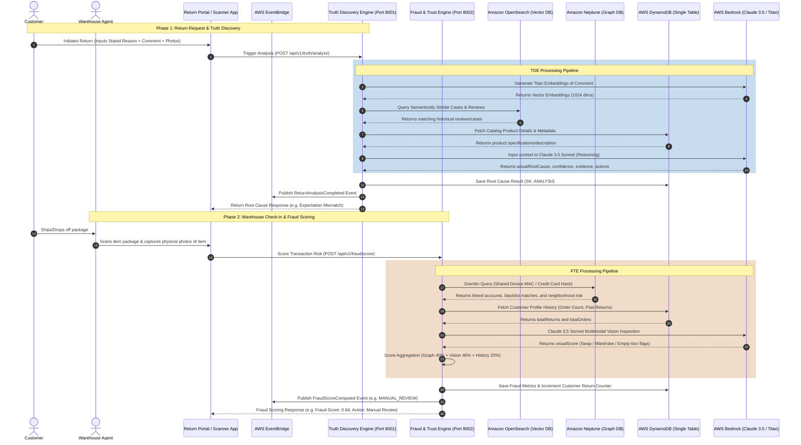

# Amazon Circular Intelligence OS
## AI Intelligence Layer: End-to-End Workflow Diagram

This document illustrates the step-by-step workflow of the **Truth Discovery Engine (TDE)** and the **Fraud & Trust Engine (FTE)** as a customer return progresses from initial request to physical check-in and refund validation.

---

## 1. End-to-End Sequence Diagram

---

## 2. Detailed Phase Breakdown

### Phase 1: Customer Request & Truth Discovery (Return portal)
1. **Intake**: A customer initiates a return online, choosing a checkbox reason (e.g., "Defective") and typing a comment (e.g., *"The camera screen won't turn on, it just displays black lines"*).
2. **Text Embedding**: The comment is vectorized into a 1024-dimensional vector using `amazon.titan-embed-text-v2`.
3. **Semantic Querying**: OpenSearch checks if other reviews or historical returns for that product category mention similar symptoms (e.g. a known hardware incompatibility or user manual error).
4. **Logical Inference**: Claude 3.5 evaluates all inputs. If reviews identify that a device does not pair with iOS 17, and the customer complains of connection failure, Claude corrects the stated "Defective" reason to a true root cause of **"Software Compatibility"**, saving downstream processing costs on intact electronics.
5. **Decoupled Egress**: The computed root cause is saved in DynamoDB and sent to EventBridge, which updates the seller dashboard to alert them to update their product listing.

### Phase 2: Warehouse Check-in & Fraud Prevention (Physical audit)
1. **Package Scan**: The package is received at the logistics node. The agent scans the package code and takes a photo of the contents.
2. **Graph Network Check**: Neptune checks if the customer's hardware fingerprint (`deviceId`) or payment options have been used by previously blocked return-abuser accounts.
3. **Multimodal Inspection**: Claude 3.5 Sonnet compares the physical return photo with catalog benchmarks:
   - **Wardrobing**: Scans for creasing, wrinkles, missing tags, or re-attached tags on clothing.
   - **Swapping**: Inspects if details like logos, model numbers, or casing colors deviate from standard catalog photos.
   - **Empty-box**: Scans if the package consists of empty cardboard/bubble-wrap.
4. **Score Merging**: The system aggregates Neptune Graph Risk, visual anomalies, and customer refund-to-order frequencies.
5. **Immediate Action**: If risk is `LOW`, an automated refund triggers. If `HIGH`, the refund is blocked, and the item is routed to inspection supervisors for manual review.
