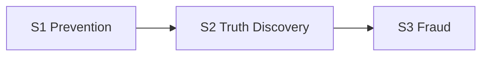
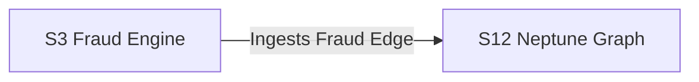
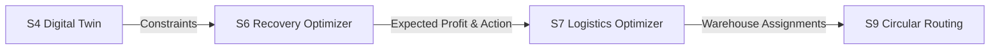
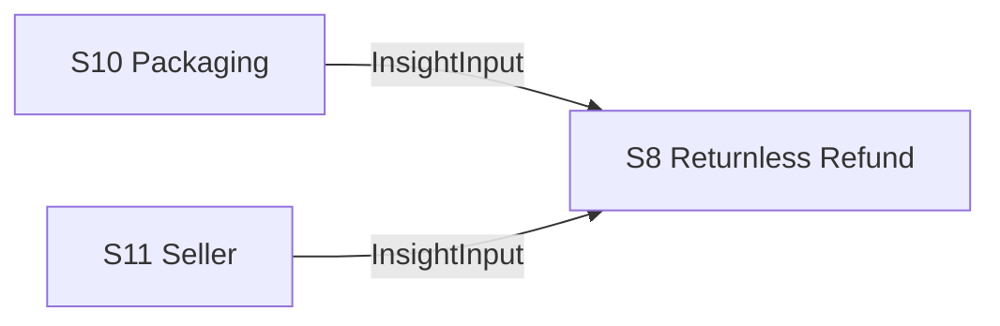

# Architecture Diagram & Details

The Circular Intelligence OS relies on 12 distinct microservices separated into 4 logical layer domains.

## The 12 Services
- **S1 Return Prevention Engine**: Analyzes purchase risk.
- **S2 Truth Discovery Engine**: Discovers root cause of returns.
- **S3 Fraud & Trust Engine**: Scores fraud probability.
- **S4 Product Digital Twin**: Tracks lifecycle state.
- **S5 Future Simulator**: Simulates recovery scenarios.
- **S6 Recovery Optimizer**: Selects optimal recovery action.
- **S7 Reverse Logistics Optimizer**: Finds cheapest warehouse route.
- **S8 Returnless Refund Engine**: Policy decision matrix.
- **S9 Circular Routing Engine**: Computes sustainability routing.
- **S10 Packaging Intelligence**: Extracts packaging defects.
- **S11 Seller Intelligence Engine**: Aggregates seller health.
- **S12 Learning & Knowledge Graph**: Persists relationships in AWS Neptune.

## Data Flow Diagrams

### S1 → S2 → S3 (Core Orchestration)

### S3 → S12 (Fraud to Knowledge Graph)

### S4 → S6 → S7 → S9 (Logistics Pipeline)

### S10 / S11 → S8 (Intelligence Streams)

